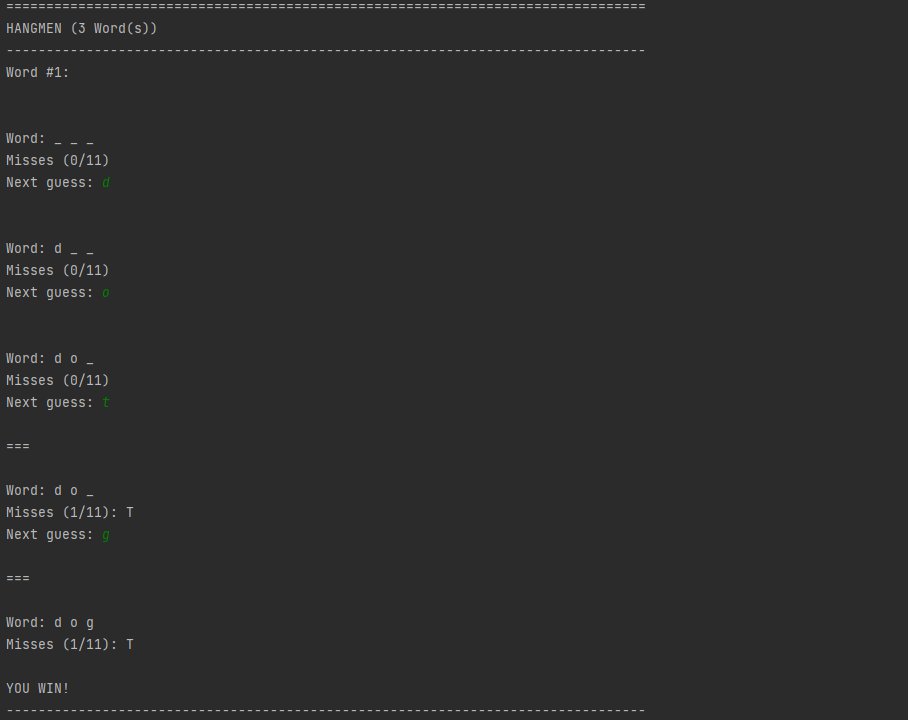
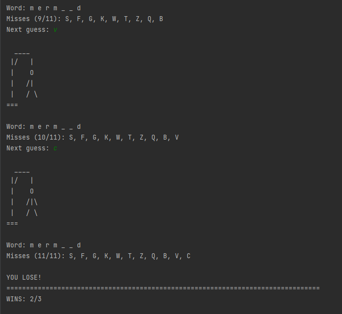
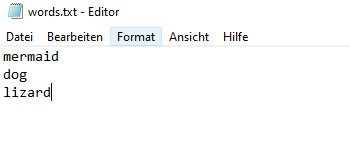

# Hangmen #
## Description ##
Hangmen game. Try to guess a word before the hangmen sketch is being completed (11 tries)

## HOW TO USE ## 
Create a textfile and enter random words into the text file (one word per line).
Copy file path and put it into build parameters.
Executing the program will use random words from the list. The user can then play the Hangmen game

# Screenshots of output #

